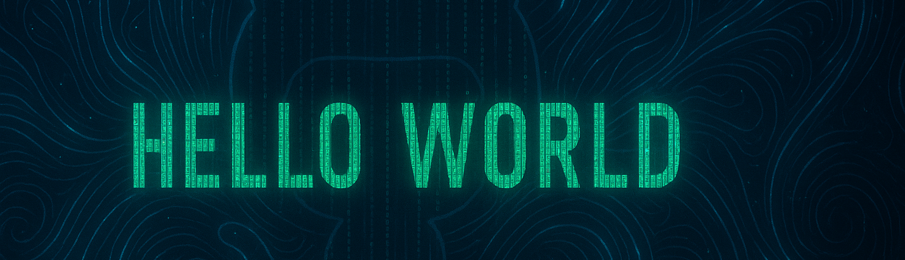

<!-- profile intro animation -->
---

  

  

<!-- Night Owl image (or your custom PNG) -->

  

<!-- Start Intro -->

I’m an Autonomous Driving Software Engineer at KARSAN Automotive, holding a degree in Electrical & Electronics Engineering from Uludağ University. After leading the Combat UAV software team at Teknofest 2023—where I architected mission-planning frameworks and oversaw end-to-end flight software—I joined KARSAN’s R&D division to advance our autonomous platforms. Today, my work centers on artificial intelligence: I design and train deep reinforcement learning agents for robust decision-making in dynamic environments, and I’m pioneering the integration of large language models to automate diagnostics, generate adaptive test scenarios, and refine human–machine interfaces. By blending AI, RL and LLM technologies, I elevate autonomous and robotic systems to new levels of intelligence and adaptability.

<!-- End Intro -->

<table align="center" width="100%" border="0" cellpadding="0" cellspacing="0" style="margin:1em auto; max-width:800px;">
  <tr>
    <!-- Sol sütun: ikonlu liste -->
    <td valign="top" width="60%" style="padding-right:1em; font-size:90%;">
      <h2></h2>
      <ul style="margin:0; padding-left:1.2em;">
        <li>🧠 <strong>AI &amp; ML</strong>
          <ul style="margin:0; padding-left:1.2em;">
            <li>🔬 Supervised / Unsupervised Learning</li>
            <li>🤖 Deep Learning</li>
            <li>🎯 Reinforcement Learning (PPO, SAC, A2C, DDPG, DQN)</li>
            <li>📸 Computer Vision (CNN, SVM, k-NN, Random Forest)</li>
            <li>⚙️ Metaheuristic Optimization (GWO, HHO, PSO, GA)</li>
          </ul>
        </li>
        <li>🚗 <strong>Autonomous &amp; Robotics</strong>
          <ul style="margin:0; padding-left:1.2em;">
            <li>🕹️ Motion Control (MPC, PID, LQR, Stanley, Pure Pursuit)</li>
            <li>🗺️ Motion Planning (A*, RRT*, FMT, Hybrid A*)</li>
            <li>📍 SLAM &amp; Localization (HDL-Graph SLAM, NDT, ICP)</li>
            <li>🔗 Sensor Fusion</li>
          </ul>
        </li>
        <li>💻 <strong>Languages &amp; Tools</strong>
          <ul style="margin:0; padding-left:1.2em;">
            <li>🐍 Python</li>
            <li>💠 C++</li>
            <li>📊 MATLAB / Simulink</li>
            <li>🔌 Embedded C, Bash, Arduino</li>
            <li>🚀 ROS, Docker, Git, CI/CD</li>
          </ul>
        </li>
        <li>🎮 <strong>Simulation &amp; Viz</strong>
          <ul style="margin:0; padding-left:1.2em;">
            <li>🖥️ CARLA Simulator</li>
            <li>🌐 Unreal Engine 4</li>
          </ul>
        </li>
        <li>🖥️ <strong>OS &amp; Embedded</strong>
          <ul style="margin:0; padding-left:1.2em;">
            <li>🐧 Linux (Ubuntu &amp; embedded)</li>
            <li>🪟 Windows</li>
          </ul>
        </li>
      </ul>
    </td>
    <td valign="middle" width="40%" style="text-align:center;">
      <picture>
        <source media="(prefers-color-scheme: dark)"  srcset="./.github/Skills_Animation_Dark.gif">
        <source media="(prefers-color-scheme: light)" srcset="./.github/Skills_Animation_White.gif">
        
      </picture>
    </td>
  </tr>
</table>

  

  

 
 

---
